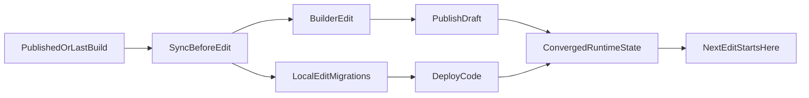

# Workflow "Git = Source de Vérité" (v2)

## Objectif

**Un seul endroit pour la vérité : Git.** Pas de divergence entre Builder, code local et production.

- **Avant** : Builder → KV/Blob, Code Local → Git, deux sources de vérité
- **Maintenant** : Builder → Git, Code Local → Git, une source unique

## Architecture

```
┌─ BUILDER (Interface admin)
│  ├─ Load page → GET /api/admin/page-content/load?page=X
│  │  └─ Retourne document + SHA courant
│  └─ Publish → POST /api/admin/page-content/publish
│     ├─ Envoie document + SHA
│     ├─ Vérifie que SHA n'a pas changé (409 Conflict si divergence)
│     └─ Commit auto vers Git + Push
│
├─ CODE LOCAL
│  └─ Modifier `src/data/pages/{page}.json`
│     └─ Commit + Push manuel Git
│
└─ GIT (Source de vérité unique)
   ├─ Stocke `src/data/pages/*.json` versionné
   ├─ Historique complet des modifications
   └─ Webhook déclenche déploiement automatique

DÉPLOIEMENT
   ├─ Vercel deploy depuis Git
   └─ Cloudflare Pages deploy depuis Git
```

## Workflows

### Flux A — Modifier via Builder

1. Ouvrir Builder, sélectionner la page
2. Builder charge le document + SHA courant
3. Éditer le contenu / structure
4. Cliquer "Save Draft" → validation locale uniquement
5. Cliquer "Publish"
   - ✅ Si pas de modification concurrent : commit auto dans Git + push
   - ⚠️ Si conflit (SHA a changé) : erreur 409, builder recharge et propose fusion
6. Git webhook déclenche déploiement (Vercel + Cloudflare)

### Flux B — Modifier en local

1. Éditer `src/data/pages/{page}.json`
2. `git commit -m "content: update {page}"`
3. `git push origin main`
4. Git webhook déclenche déploiement automatique
5. Builder sera à jour au prochain reload

### Flux C — Conflit d'édition concurrente

Exemple : vous éditez en local tandis que quelqu'un publie via le builder.

Symptômes :
- Builder affiche "⚠️ Conflit : la page a été modifiée ailleurs"
- HTTP `409 Conflict`

Résolution automatique :
1. Builder recharge la page du serveur
2. Vous voyez la version la plus récente
3. Fusionnez manuellement vos changements
4. Publiez à nouveau

## Matrice “où faire quoi”

- **Éditorial courant** (textes, contenus métier rapides) : Builder.
- **Structure durable** (remplacements de sections, contraintes de rendu) : local + migrations versionnées.
- **Styles système/global** : local.
- **Ajustements ponctuels de page** : Builder si pas de règle de convergence globale.

## Checklist pré-publish

- [ ] Je suis parti du dernier état publié/buildé.
- [ ] Les changements de structure ont une migration versionnée (ID unique).
- [ ] Builder et preview local sont cohérents.
- [ ] Les liens/ancres critiques fonctionnent.

## Checklist pré-deploy

- [ ] Build passe.
- [ ] `npm run test:e2e` passe.
- [ ] Pas d'écart connu Builder/Public sur les pages impactées.
- [ ] Risques de divergence documentés si convergence partielle.
- [ ] L'état déployé devient la nouvelle référence opérationnelle.
- [ ] `git fetch origin` + `git status -sb` confirment l'etat d'ecart local/remote attendu.
- [ ] `npx vercel ls givre-reyone` confirme le dernier deploy production cible.

## Convention de nommage des migrations

Format recommandé : `v1-<scope>-vN`

Exemples :

- `v1-contact-cta-v2`
- `v1-footer-legal-links-v1`

Règles :

- ne jamais modifier une migration déjà en production pour changer son comportement,
- créer une nouvelle migration avec un nouvel ID.

## Schéma de référence



## Validation UX/UI automatisée

La suite Playwright vérifie la navigation, des captures d'écran desktop/mobile et des garde-fous UX.

Commandes :

- `npm run test:e2e` : smoke + builder + visual regression + checks UX/UI.
- `npm run test:e2e:smoke` : navigation et garde-fous.
- `npm run test:e2e:builder` : options builder, changement de page, rendu attendu.
- `npm run test:e2e:visual` : snapshots visuels stables.
- `npm run test:e2e:ui` : exécution interactive locale.
- `npm run test:e2e:update` : à utiliser uniquement pour valider un changement visuel attendu.

Prérequis pour `test:e2e:builder` :

- exporter `ADMIN_TOKEN` (ou `E2E_ADMIN_TOKEN`) dans l'environnement.
- sans token, les tests builder sont skip avec message explicite.

Bonnes pratiques :

- lancer les tests après toute modification significative Builder ou locale,
- si un diff visuel apparaît, confirmer d'abord qu'il est attendu avant mise à jour,
- ne pas déployer tant que la suite UX/UI n'est pas verte.

## Routine d'audit de convergence (Local / GitHub / Vercel)

Executer cette routine avant cloture d'une livraison:

1. **Etat git local**
   - `git status --short`
   - `git status -sb`
2. **Etat remote**
   - `git fetch origin`
   - verifier ahead/behind sur la branche active
3. **Etat Vercel production**
   - `npx vercel whoami`
   - `npx vercel ls givre-reyone`
4. **Validation qualite**
   - `npm run test:e2e:builder`
   - `npm run test:e2e:visual`
   - `npm run test:e2e:smoke`

Decision:
- si local est valide mais ahead de GitHub: commit/push,
- si GitHub est a jour mais Vercel est ancien: deploy,
- si des tests echouent: corriger avant sync finale.

Notes Builder UI :

- le style GrapesJS (dark mode) est centralisé dans `src/styles/admin.css`,
- les labels de blocs custom (dans `src/scripts/builder-admin.js`) utilisent des icônes inline SVG pour éviter les dépendances externes,
- la visual regression couvre aussi les zones sensibles Builder (toolbar, blocks panel, modal overlay).
