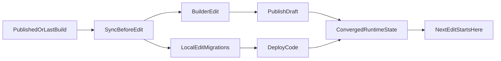

# Workflow de vérité Builder / Local / KV

## Objectif

Éviter les divergences entre Builder, KV/Blob, code local et rendu public.

Principe directeur : **toujours repartir de la dernière version publiée/buildée validée**.

## Définitions

- **Builder** : interface d'édition (draft/publish).
- **Draft** : version en cours côté KV/Blob, non encore promue.
- **Published** : version publiée côté KV/Blob, utilisée par le public.
- **Migrations** : transformations versionnées du document (ID unique par changement structurel).
- **Convergence** : état où Builder et public affichent la même structure/rendu.

## Flux A — Modifier via Builder

1. Ouvrir le Builder et vérifier la page cible.
2. Vérifier que la base de travail correspond au dernier état attendu (draft/published).
3. Faire les modifications dans Builder.
4. Save draft, puis Publish.
5. Vérifier le rendu public.
6. Si des règles locales (migrations) existent, vérifier que le rendu reste aligné côté Builder.

## Flux B — Modifier en local

1. Partir de la dernière version publiée/buildée.
2. Implémenter le changement local.
3. Si structure modifiée, créer une **nouvelle migration** avec un **nouvel ID**.
4. Vérifier l'idempotence de la migration.
5. Build + tests visuels.
6. Déployer et vérifier la convergence Builder/Public.

## Flux C — Conflit ou retard de synchronisation

Symptômes typiques :

- Builder et public affichent des sections différentes.
- Une ancienne structure réapparaît dans Builder.
- Un style local ne s'applique pas comme prévu.

Procédure :

1. Identifier la base réellement utilisée (draft ou published).
2. Vérifier les migrations appliquées.
3. Vérifier si un `projectData` ancien écrase le HTML convergé.
4. Repartir du dernier état publié puis réappliquer le changement proprement.
5. Save/Publish/Deploy pour figer la convergence.

## Matrice “où faire quoi”

- **Éditorial courant** (textes, contenus métier rapides) : Builder.
- **Structure durable** (remplacements de sections, contraintes de rendu) : local + migrations versionnées.
- **Styles système/global** : local.
- **Ajustements ponctuels de page** : Builder si pas de règle de convergence globale.

## Checklist pré-publish

- [ ] Je suis parti du dernier état publié/buildé.
- [ ] Les changements de structure ont une migration versionnée (ID unique).
- [ ] Builder et preview local sont cohérents.
- [ ] Les liens/ancres critiques fonctionnent.

## Checklist pré-deploy

- [ ] Build passe.
- [ ] `npm run test:e2e` passe.
- [ ] Pas d'écart connu Builder/Public sur les pages impactées.
- [ ] Risques de divergence documentés si convergence partielle.
- [ ] L'état déployé devient la nouvelle référence opérationnelle.
- [ ] `git fetch origin` + `git status -sb` confirment l'etat d'ecart local/remote attendu.
- [ ] `npx vercel ls givre-reyone` confirme le dernier deploy production cible.

## Convention de nommage des migrations

Format recommandé : `v1-<scope>-vN`

Exemples :

- `v1-contact-cta-v2`
- `v1-footer-legal-links-v1`

Règles :

- ne jamais modifier une migration déjà en production pour changer son comportement,
- créer une nouvelle migration avec un nouvel ID.

## Schéma de référence

## Validation UX/UI automatisée

La suite Playwright vérifie la navigation, des captures d'écran desktop/mobile et des garde-fous UX.

Commandes :

- `npm run test:e2e` : smoke + builder + visual regression + checks UX/UI.
- `npm run test:e2e:smoke` : navigation et garde-fous.
- `npm run test:e2e:builder` : options builder, changement de page, rendu attendu.
- `npm run test:e2e:visual` : snapshots visuels stables.
- `npm run test:e2e:ui` : exécution interactive locale.
- `npm run test:e2e:update` : à utiliser uniquement pour valider un changement visuel attendu.

Prérequis pour `test:e2e:builder` :

- exporter `ADMIN_TOKEN` (ou `E2E_ADMIN_TOKEN`) dans l'environnement.
- sans token, les tests builder sont skip avec message explicite.

Bonnes pratiques :

- lancer les tests après toute modification significative Builder ou locale,
- si un diff visuel apparaît, confirmer d'abord qu'il est attendu avant mise à jour,
- ne pas déployer tant que la suite UX/UI n'est pas verte.

## Routine d'audit de convergence (Local / GitHub / Vercel)

Executer cette routine avant cloture d'une livraison:

1. **Etat git local**
   - `git status --short`
   - `git status -sb`
2. **Etat remote**
   - `git fetch origin`
   - verifier ahead/behind sur la branche active
3. **Etat Vercel production**
   - `npx vercel whoami`
   - `npx vercel ls givre-reyone`
4. **Validation qualite**
   - `npm run test:e2e:builder`
   - `npm run test:e2e:visual`
   - `npm run test:e2e:smoke`

Decision:
- si local est valide mais ahead de GitHub: commit/push,
- si GitHub est a jour mais Vercel est ancien: deploy,
- si des tests echouent: corriger avant sync finale.

Notes Builder UI :

- le style GrapesJS (dark mode) est centralisé dans `src/styles/admin.css`,
- les labels de blocs custom (dans `src/scripts/builder-admin.js`) utilisent des icônes inline SVG pour éviter les dépendances externes,
- la visual regression couvre aussi les zones sensibles Builder (toolbar, blocks panel, modal overlay).
